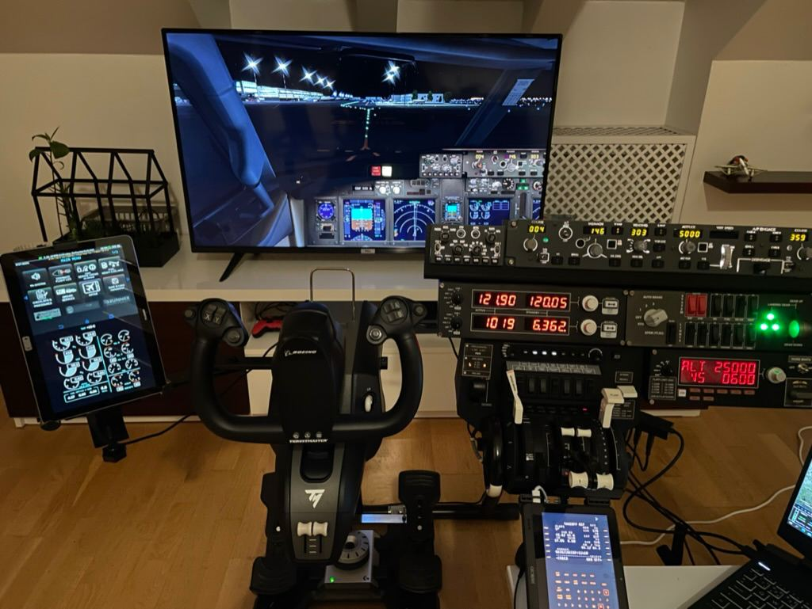

# Boeing 737-800 (Zibo mod) configuration

This repository contains the hardware settings of Boeing 737-800 for Xplane 11.

### Configurations for the following hardware:
1. Thrustmaster TCA Yoke Pack Boeing Edition
2. Honeycomb Aeronautical BRAVO THROTTLE QUADRANT 
3. Saitek Pro Flight Radio Panel
4. Saitek Pro Flight Switch Panel
5. Saitek Pro Flight Multi Panel

# How to use
Make a backup of your Xplane folder and then copy the contents of this repository to the Xplane folder.
